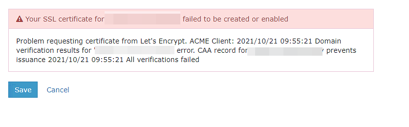
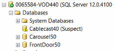

# Instructions

For each of the escalations below provide 1) a proposed response to the cusomter, "Tony Hawk" at "Example TV" and 2) a message to the Cablecast engineering staff explaing your theories about the issue, and why you recomended what you did to the customer. The message to the engineering team should include any relevant search queries / results from google that helped you formulate your response.

There are no right or wrong answers, don't spend more than an hour working on all of the escalations.

Thanks!

# Can't Get Https working

## Background

The Cablecast software allows automatic generation and renewel of SSL certs using Let's Encrypt (https://letsencrypt.org/). 

## Issue

Customer is trying to enable SSL but is getting the attatched error message in the Cablecast UI. 

# Live Source Is Black

## Background

Cablecast systems usually control a video routing switcher. This allows cablecast to route different video sources, such as studio feeds, sattelites, etc to air at the correct time. A commmon routing switcher is the Blackmagic Design Videohub (https://www.blackmagicdesign.com/products/smartvideohub).

## Issue

Customer reports that there Dish Network Sattelite feed is reporting no signal and the previews of it in Cablecast are black. All the other sources on their router work. In the Blackmagic videohub they see the the Dish Network feed show up on the routing switchers preview. 

# Cablecast User Interface Not Loading

## Background

Cablecast uses MSSQL Server 2014 Express as a database. Our servers ship with MSSQL Studio installed which allows for running SQL commands and performing administrative tasks.

## Issue

Customer gets 500 errors when trying to login into Cablecast. Customer service team looked at the issue and realized it was an issue with the database connection. They opened SQL server and see that the Cablecast40 database is reporting as suspect.

# Live Stream Not Working When Embeded In Website

## Issue

Customer is trying to embed their live stream on their stations website. The stream works fine in Cablecast UI but doesn't work when embedded. Link to the page where it's embedded is here: https://www.cablecast.tv/engineering

